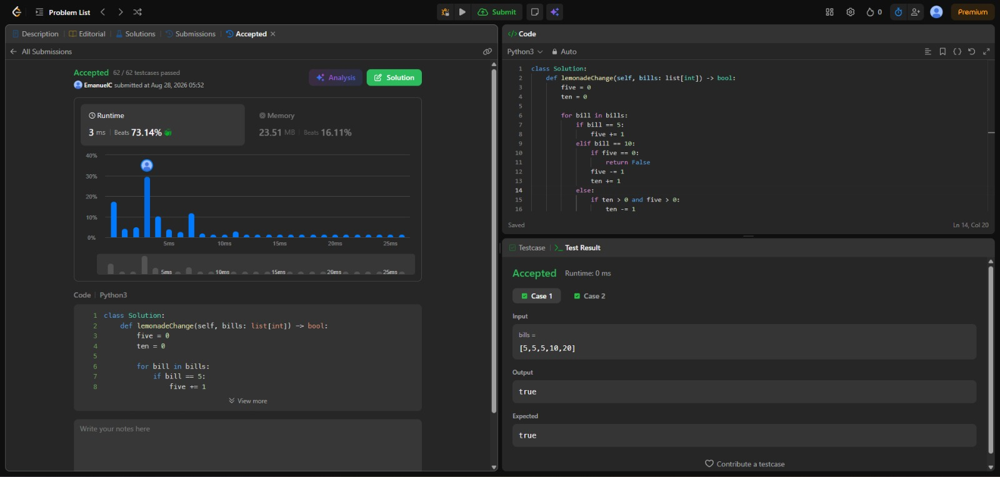
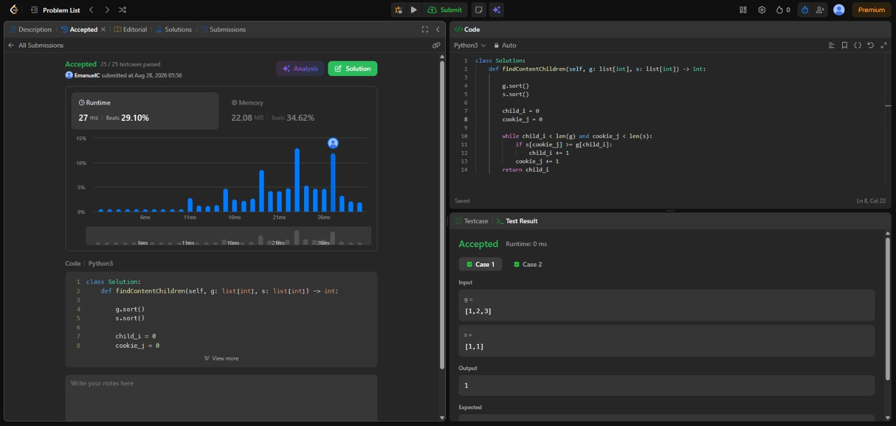

# Tarea 1 · Algoritmos Greedy en LeetCode

**Curso:** Análisis de Algoritmos  
**Institución:** ITM · 2026-2  

---

## 1. [860. Lemonade Change](https://leetcode.com/problems/lemonade-change/)

* **Criterio Greedy:** Al recibir un billete de $20 (requiere $15 de cambio), se prioriza entregar $10 + $5 en lugar de 3 billetes de $5. Esto preserva los billetes de $5, que son el recurso más crítico y versátil para poder atender futuros pagos de $10.
* **Complejidad Temporal:** $O(n)$ — Un solo recorrido lineal sobre el arreglo `bills`.
* **Complejidad Espacial:** $O(1)$ — Solo se mantienen contadores para billetes de 5 y 10.

### Evidencia de Aceptación

---

## 2. [455. Assign Cookies](https://leetcode.com/problems/assign-cookies/)

* **Criterio Greedy:** Se ordenan de menor a mayor la exigencia de los niños (`g`) y el tamaño de las galletas (`s`). Se asigna la galleta disponible más pequeña que cumpla $s[j] \ge g[i]$ al niño menos exigente pendiente, reservando las galletas de mayor tamaño para niños con mayor factor de codicia.
* **Complejidad Temporal:** $O(n \log n + m \log m)$ — Dominada por el ordenamiento de ambos arreglos ($n = |g|, m = |s|$). El recorrido con dos punteros es $O(n + m)$.
* **Complejidad Espacial:** $O(1)$ — Uso de punteros in-place sobre las estructuras ordenadas.

### Evidencia de Aceptación
