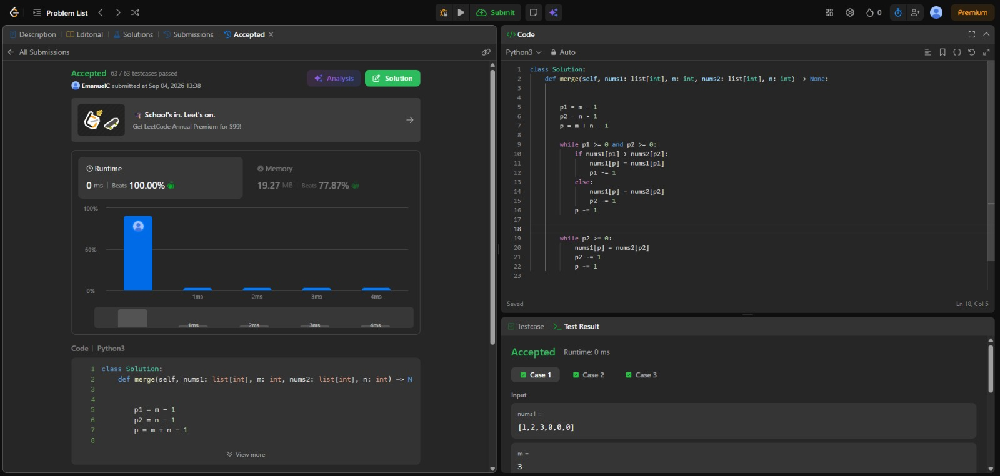
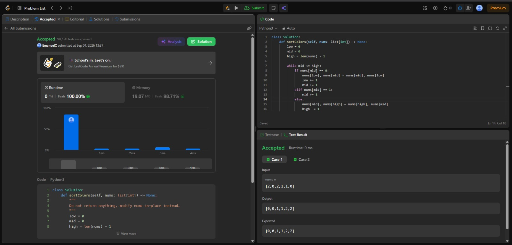

# Tarea 2 · Algoritmos de Ordenamiento en LeetCode

**Curso:** Análisis de Algoritmos  
**Institución:** ITM · 2026-2  

---

## 1. [88. Merge Sorted Array](https://leetcode.com/problems/merge-sorted-array/)

* **Algoritmo:** Fusión lineal inversa desde el final (Two Pointers).
* **Justificación:** Dado que ambos arreglos ya están preordenados, no se requiere un sort comparativo completo ($O((m+n)\log(m+n))$). Aprovechar la fase de `merge` escribiendo desde la posición $m + n - 1$ hacia atrás evita pisar los elementos válidos de `nums1` y elimina la necesidad de memoria auxiliar adicional.
* **Complejidad Temporal:** $O(m + n)$ — Se procesa cada elemento de `nums1` y `nums2` a lo sumo una vez.
* **Complejidad Espacial:** $O(1)$ — Modificación *in-place* sobre el arreglo `nums1` sin estructuras adicionales.

### Evidencia de Accepted

---

## 2. [75. Sort Colors](https://leetcode.com/problems/sort-colors/)

* **Algoritmo:** Partición de la Bandera Nacional Holandesa (Dutch National Flag / Tres Punteros).
* **Justificación:** El problema restringe el universo de claves a un conjunto finito $k = 3$ ($\{0, 1, 2\}$). Un sort comparativo general incurriría en una cota inferior de $\Omega(n \log n)$. Al usar la partición de tres punteros (`low`, `mid`, `high`), se clasifican los elementos en una única pasada in-place sin violar el modelo de comparaciones, ya que no se busca un orden relativo general sino segregar tres clases conocidas en tiempo lineal.
* **Complejidad Temporal:** $O(n)$ — Donde $n$ es la cantidad de elementos en `nums`; cada iteración clasifica un elemento o reduce el espacio no procesado.
* **Complejidad Espacial:** $O(1)$ — Espacio auxiliar constante, realiza intercambios directamente sobre el arreglo original.

### Evidencia de Accepted
